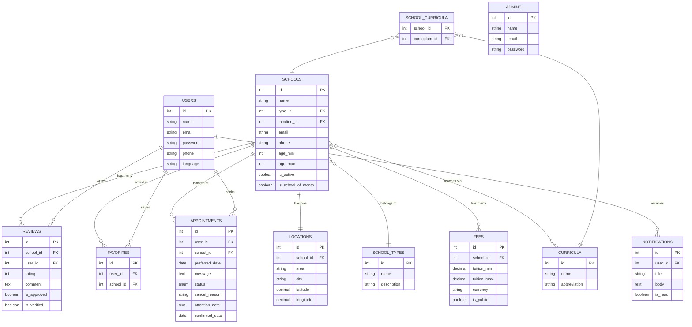
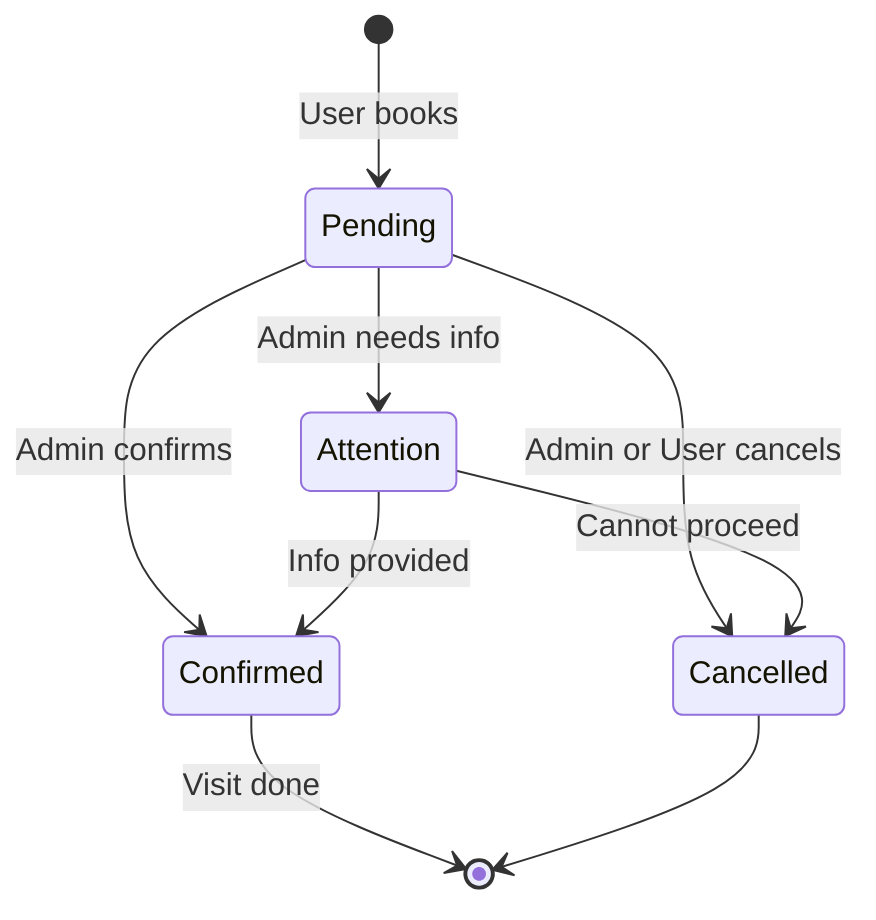

<div align="center">


# SchoolFinder Egypt 🏫

**The ultimate platform for finding international schools in Egypt**

Browse · Compare · Book Appointments · Read Verified Reviews

[Live Demo](#) · [API Docs](#api-reference) · [Android App](#android-app) · [Report Bug](../../issues)

</div>

---

## Table of Contents

- [About](#about)
- [Screenshots](#screenshots)
- [Tech Stack](#tech-stack)
- [Features](#features)
- [Getting Started](#getting-started)
- [API Reference](#api-reference)
- [Database ERD](#database-erd)
- [Android App](#android-app)
- [Project Structure](#project-structure)
- [CI/CD](#cicd)
- [License](#license)

---

## About

SchoolFinder Egypt helps Egyptian parents **discover, compare, and contact** international schools across Cairo and Egypt. Parents can search by curriculum, location, and fees — then book a school visit appointment directly through the platform.

### Key Highlights

- 🔍 **Smart Search** — Filter by type, curriculum, location, and fee range
- 📊 **School Comparison** — Compare up to 3 schools side by side
- 📅 **Appointment Booking** — Book school visits with real-time status tracking
- ✅ **Verified Reviews** — Only parents with confirmed visits can review
- 📱 **Android App** — Offline-first with Room database caching
- 🌐 **Bilingual** — Arabic (RTL) and English support

---

## Screenshots

| Homepage | School Detail | Admin Dashboard |
|----------|--------------|-----------------|
|  |  |  |

| Android Home | Android Detail | Android Appointments |
|--------------|---------------|---------------------|
|  |  |  |

> Screenshots coming soon — run the project locally to preview

---

## Tech Stack

### Backend (Laravel API)

| Technology | Version | Purpose |
|-----------|---------|---------|
| PHP | 8.2 | Server language |
| Laravel | 11 | Web framework |
| MySQL | 8.0 | Primary database |
| Laravel Sanctum | 4.x | API token authentication |
| DomPDF | Latest | PDF generation for comparison |

### Frontend (Web)

| Technology | Purpose |
|-----------|---------|
| Blade Templates | Server-side rendering |
| Vanilla JavaScript | UI interactions |
| CSS3 | Styling with custom design system |
| GSAP 3 | Animations on homepage |

### Mobile (Android)

| Library | Purpose |
|--------|---------|
| Java | Native Android development |
| Retrofit2 | HTTP client for API |
| OkHttp3 | Logging interceptor |
| Room | Local SQLite database (offline) |
| LiveData + ViewModel | MVVM architecture |
| Glide | Image loading |

---

## Features

### For Parents (Users)
- [x] Browse all international schools with pagination
- [x] Search by name, area, or curriculum
- [x] Filter by type, curriculum, location, fee range
- [x] Sort by name, fee (low/high), or rating
- [x] View detailed school profiles
- [x] Compare up to 3 schools side by side
- [x] Save schools to favorites
- [x] Book school visit appointments
- [x] Track appointment status (Pending → Confirmed/Cancelled/Attention)
- [x] Submit verified reviews (after confirmed visit)
- [x] Receive notifications on appointment updates
- [x] Full profile management

### For Admins
- [x] Dashboard with real-time stats
- [x] Full CRUD on all schools
- [x] Set "School of the Month" featured school
- [x] Manage and approve/reject reviews
- [x] Update appointment statuses with notes
- [x] Send custom notifications to users
- [x] Edit homepage content dynamically
- [x] User management

### Android App (Offline-First)
- [x] All browsing features work offline (cached with Room)
- [x] Offline banner when no internet connection
- [x] Auto-sync when connection returns
- [x] Book appointments with date picker
- [x] View all 4 appointment statuses

---

## Getting Started

### Prerequisites

```bash
PHP >= 8.2
Composer
MySQL 8.0
Node.js (optional, for assets)
```

### Installation

**1. Clone the repository**

```bash
git clone https://github.com/your-username/schoolfinder-egypt.git
cd schoolfinder-egypt
```

**2. Install PHP dependencies**

```bash
composer install
```

**3. Set up environment**

```bash
cp .env.example .env
php artisan key:generate
```

**4. Configure database in `.env`**

```env
DB_CONNECTION=mysql
DB_HOST=127.0.0.1
DB_PORT=3306
DB_DATABASE=schoolfinder
DB_USERNAME=root
DB_PASSWORD=your_password
```

**5. Run migrations and seeders**

```bash
php artisan migrate
php artisan db:seed
```

**6. Start the server**

```bash
php artisan serve
```

**7. Visit the app**

```
Web App:  http://localhost:8000
API:      http://localhost:8000/api
```

### Default Credentials

| Role | Email | Password |
|------|-------|----------|
| Admin | admin@schoolfinder.com | admin123 |
| Parent | omar@test.com | password123 |
| Parent | sara@test.com | password123 |

---

## API Reference

### Base URL
```
Development: http://localhost:8000/api
Android Emulator: http://10.0.2.2:8000/api
```

### Authentication

All protected routes require:
```
Authorization: Bearer {token}
Accept: application/json
```

### Response Format

```json
{
  "success": true,
  "message": "Login successful",
  "data": {
    "token": "1|abc123...",
    "user": { "id": 1, "name": "Omar", "role": "user" }
  }
}
```

### Endpoints Overview

| Method | Endpoint | Auth | Description |
|--------|----------|------|-------------|
| POST | `/auth/register` | ❌ | Register new user |
| POST | `/auth/login` | ❌ | Login → get token |
| POST | `/auth/logout` | ✅ | Logout |
| GET | `/auth/me` | ✅ | Get current user |
| GET | `/schools` | ❌ | List schools (paginated) |
| GET | `/schools/{id}` | ❌ | School details |
| GET | `/schools/compare?ids[]=1&ids[]=2` | ❌ | Compare schools |
| GET | `/favorites` | ✅ | My favorites |
| POST | `/favorites/{id}` | ✅ | Add favorite |
| DELETE | `/favorites/{id}` | ✅ | Remove favorite |
| GET | `/appointments` | ✅ | My appointments |
| POST | `/appointments` | ✅ | Book appointment |
| PUT | `/appointments/{id}/cancel` | ✅ | Cancel appointment |
| GET | `/notifications` | ✅ | My notifications |

#### School Search Parameters

```
GET /api/schools?search=BISC&type=British&curriculum=IGCSE&location=Maadi&sort=rating&per_page=12&page=1
```

| Param | Type | Description |
|-------|------|-------------|
| `search` | string | Search name or area |
| `type` | string | British, American, German, French |
| `curriculum` | string | IGCSE, IB Diploma, A-Levels, etc. |
| `location` | string | Area or city name |
| `fee_min` | integer | Minimum annual fee (EGP) |
| `fee_max` | integer | Maximum annual fee (EGP) |
| `sort` | string | `name`, `fee_low`, `fee_high`, `rating` |
| `per_page` | integer | Results per page (max 50) |

---

## Database ERD

> View the interactive ERD: **[docs/erd.html](docs/erd.html)** — drag tables, zoom, click to highlight connections

### Static ERD (Mermaid)



### Appointment Status Flow



---

## Android App

### Setup

1. Open `schoolfinder-android/` in Android Studio
2. Update `BASE_URL` in `ApiClient.java`:

```java
// Emulator
private static final String BASE_URL = "http://10.0.2.2:8000/api/";

// Real device (same WiFi) — find your PC IP with ipconfig
private static final String BASE_URL = "http://192.168.1.x:8000/api/";
```

3. Make sure Laravel is running: `php artisan serve`
4. Run the app on emulator or device

### Architecture

```
ui/          → Activities + Adapters (View layer)
viewmodel/   → ViewModels with LiveData
repository/  → Smart online/offline data layer
api/         → Retrofit service + models
db/          → Room entities + DAOs
utils/       → SessionManager, NetworkUtils
```

---

## Project Structure

```
schoolfinder-egypt/
├── app/
│   ├── Http/
│   │   ├── Controllers/
│   │   │   ├── Auth/AuthController.php
│   │   │   ├── SchoolController.php
│   │   │   ├── AppointmentController.php
│   │   │   ├── ReviewController.php
│   │   │   ├── FavoriteController.php
│   │   │   ├── NotificationController.php
│   │   │   └── Admin/
│   │   ├── Middleware/
│   │   └── Traits/ApiResponse.php
│   └── Models/
│       ├── School.php
│       ├── User.php
│       ├── Admin.php
│       ├── Appointment.php
│       ├── Review.php
│       ├── Favorite.php
│       └── Notification.php
├── database/
│   ├── migrations/
│   └── seeders/
├── resources/
│   └── views/
│       ├── layouts/
│       ├── home/
│       ├── user/
│       └── admin/
├── routes/
│   ├── api.php
│   ├── api_auth.php
│   ├── api_admin.php
│   └── web.php
├── docs/
│   ├── erd.html          ← Interactive ERD diagram
│   └── DOCUMENTATION.md  ← Full PRD document
├── .github/
│   └── workflows/
│       └── laravel.yml   ← CI/CD pipeline
├── schoolfinder-android/ ← Android app source
└── README.md
```

---

## CI/CD

This project uses **GitHub Actions** for automated testing.

Every push to `main` triggers:

```
✅ Setup PHP 8.2
✅ Install Composer dependencies
✅ Configure MySQL test database
✅ Run migrations + seeders
✅ Execute PHPUnit tests
```

See [`.github/workflows/laravel.yml`](.github/workflows/laravel.yml)

---

## Contributing

1. Fork the repository
2. Create your feature branch: `git checkout -b feature/amazing-feature`
3. Commit your changes: `git commit -m 'Add amazing feature'`
4. Push to the branch: `git push origin feature/amazing-feature`
5. Open a Pull Request

---

## License

Distributed under the MIT License. See [`LICENSE`](LICENSE) for more information.


